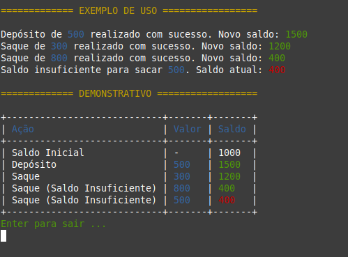

# Exercício Prático: Conta Corrente

---
<div align="justify">
Este é um script em Ruby que implementa uma classe denominada ContaCorrente. A classe ContaCorrente permite gerenciar operações básicas de uma conta corrente, como depósito e saque de fundos, com validação para garantir que não seja possível sacar mais do que o saldo disponível.

---
## Funcionalidades

🔹 Depósito de Fundos: Utilize o método depositar(valor) para adicionar fundos à conta corrente.

🔹 Saque de Fundos: Utilize o método sacar(valor) para retirar fundos da conta corrente. Um saque não será permitido caso o saldo seja inferior ao valor solicitado.

---
## Exemplo de Uso

🔹A classe ContaCorrente é uma implementação básica de uma conta bancária em Ruby. Ela permite ao usuário gerenciar operações comuns em uma conta corrente, como depósito e saque de fundos.

🔹Ao criar uma instância da classe ContaCorrente, o usuário pode especificar um saldo inicial. Em seguida, ele pode utilizar os métodos depositar(valor) e sacar(valor) para adicionar fundos à conta ou retirar fundos dela, respectivamente.

🔹Uma característica importante da classe ContaCorrente é que ela realiza uma validação no momento do saque para garantir que o saldo disponível seja suficiente para cobrir o valor solicitado. Caso o saldo seja insuficiente, o saque não é permitido.

---

## Como Executar

1. Certifique-se de ter o Ruby instalado em sua máquina.
2. Clone este repositório ou copie o script `init.rb`.
3. Navegue até o diretório onde o script está localizado.
4. Execute o script com o comando:
   ```bash
   ruby init.rb

## Visualização
### Exemplo da funcionalidade


</div>