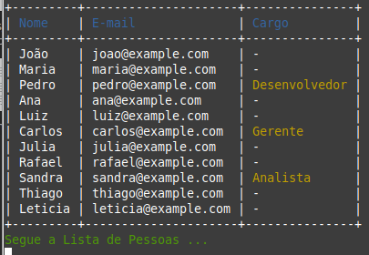

# Exercício Prático: Lista de Pessoas com Funcionários

Este projeto é um exercício prático para criar uma lista de pessoas utilizando arrays em Ruby. O objetivo é armazenar informações de nome e e-mail para cada pessoa, e para os funcionários, também armazenar o cargo que ocupam. Ao percorrer a lista, o script chamará um método `full_informations` para montar uma string com todos os dados de cada pessoa.

## Estrutura do Projeto

O projeto consiste em um script Ruby (`lista_pessoas.rb`) que realiza as seguintes tarefas:

1. Cria uma lista mista de 10 pessoas, sendo 3 delas funcionários.
2. Armazena o nome, e-mail e, no caso dos funcionários, o cargo.
3. Percorre a lista e chama o método `full_informations` para montar e exibir uma string com todas as informações de cada pessoa.

## Exemplo de Uso

### Classe Pessoa

A classe `Pessoa` possui os atributos `nome` e `email`, além de um método `full_informations` que retorna uma string com essas informações.

### Classe Funcionario

A classe `Funcionario` herda de `Pessoa` e adiciona o atributo `cargo`. O método `full_informations` é sobrescrito para incluir o cargo na string retornada.

### Script Principal

O script principal cria instâncias das classes `Pessoa` e `Funcionario`, armazena-as em um array e, em seguida, percorre esse array chamando o método `full_informations` para cada pessoa.

## Como Executar

1. Certifique-se de ter o Ruby instalado em sua máquina.
2. Clone este repositório ou copie o script `lista_pessoas.rb`.
3. Navegue até o diretório onde o script está localizado.
4. Execute o script com o comando:
   ```bash
   ruby lista_pessoas.rb

## Visualização
### Exemplo da funcionalidade
