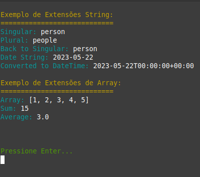

# Exercício Prático: Conta Corrente


<div align="justify">
Este script demonstra como usar a gem `activesupport` para estender as classes do Ruby, adicionando funcionalidades adicionais às classes `String` e `Array`. Também inclui exemplos de formatação de texto colorido no terminal.


## Funcionalidade

🔹O script extend_classes.rb demonstra como estender as classes String e Array usando o activesupport.


## Como Executar

1. Certifique-se de ter o Ruby instalado em sua máquina.
2. Clone este repositório ou copie o script `extend_classes.rb`.
3. Navegue até o diretório onde o script está localizado.
4. Execute o script com o comando:
   ```bash
   ruby extend_classes.rb


## Visualização
### Exemplo da funcionalidade


</div>